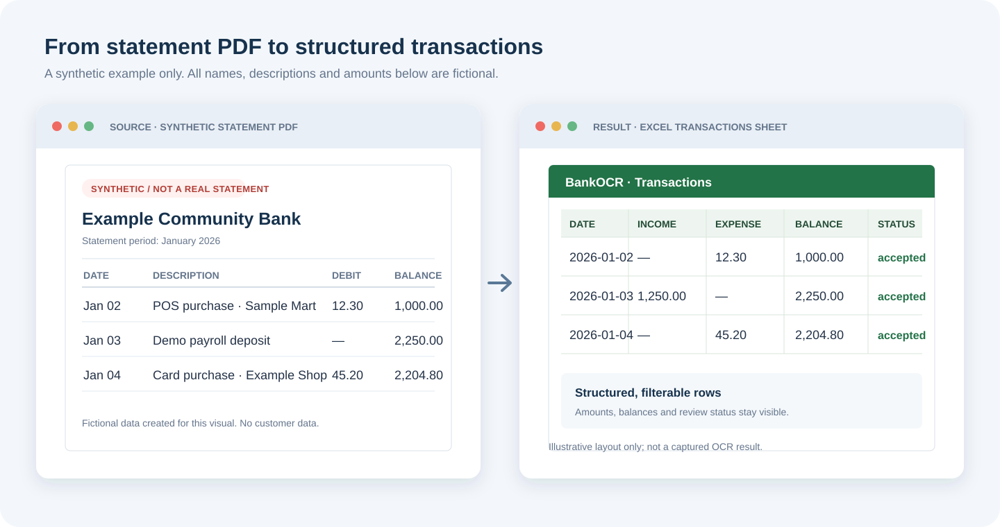

# BankOCR

[](LICENSE)
[](https://www.python.org/downloads/)
[](https://github.com/yuezhengb/bankocr)
[](https://github.com/yuezhengb/bankocr/issues?q=is%3Aissue+is%3Aopen+label%3A%22good+first+issue%22)
[](https://github.com/yuezhengb/bankocr/stargazers)

**Offline bank-statement PDF → structured Excel** — CPU-only, no cloud upload, evidence chain from OCR text to confirmed values.

**离线银行流水 PDF → 结构化 Excel**：纯 CPU、不上传云端，保留从 OCR 原文到确认值的证据链。适合财务/办公场景，也欢迎贡献者提交新银行版式模板（[good first issues](https://github.com/yuezhengb/bankocr/issues?q=is%3Aissue+is%3Aopen+label%3A%22good+first+issue%22)）。

> **Status:** V1 engineering-complete / release-candidate. A formal V1 tag is **not** claimed yet. See [`docs/v1.1-spec-implementation-audit.md`](docs/v1.1-spec-implementation-audit.md) and [`docs/v1-release-gate.md`](docs/v1-release-gate.md).

BankOCR turns scanned or native bank-statement PDFs into structured Excel, a page-faithful image workbook, a searchable PDF, a comparison PDF with source boxes, and a human review queue. It is designed to run **offline** on a CPU-only machine. Models, templates, and logs stay on the computer that runs the job.

离线银行流水 PDF 数字化工具：把扫描件或原生 PDF 转成结构化 Excel、PDF 原样图片版 Excel、可搜索 PDF、带来源框的核对 PDF，以及可人工复核的异常结果。默认完全离线，不请求外部 API、不上传流水。

## Demo

Illustrative synthetic example: the statement and spreadsheet below show fictional data and demonstrate the intended workflow. They are not a captured OCR run or a guarantee of extraction accuracy.



Need a fake statement PDF for local testing? Use [statement-synth](https://github.com/yuezhengb/statement-synth) (clearly labeled SYNTHETIC, no real PII).

Also browse related offline OCR tools: [awesome-offline-ocr](https://github.com/yuezhengb/awesome-offline-ocr).

## Problem / 要解决的问题

Bank statements arrive as PDFs that are painful to search, filter, or reconcile. Cloud OCR is often unacceptable for this data. BankOCR keeps the document on the local machine, records an evidence chain from OCR text to the confirmed value, and refuses to guess when a page layout is unknown.

银行流水经常是无法筛选的 PDF，且不宜上传到云端 OCR。BankOCR 在本地处理，保留从 OCR 原文到最终确认值的证据链；版式不确定时进入复核，而不是静默猜测。

## Features / 能力

- **CPU-first:** RapidOCR / PP-OCRv6-small + ONNX Runtime. No NVIDIA GPU required.
- **Offline:** local model and template manifests with SHA-256 pins. No runtime downloads, API calls, or log upload.
- **Page-level fault tolerance:** native text, scan, mixed, blank, rotated, duplicate, and bad pages. One failed page does not abort the document.
- **Traceable coordinates** back to the original PDF after render, rotation, deskew, and local OCR.
- **Three parsers:** known-template wired/semi-wired and positional parsing, plus a fail-closed generic path.
- **Financial checks** with `Decimal`: dates, amounts, debit/credit, balance continuity, page order, duplicates, possible missing rows.
- **Secondary OCR** only on suspicious boxes, keeping `raw_text` / `secondary_text` / `suggested_text` / `final_text`.
- **Resumable projects:** SQLite page checkpoints, pause/resume/cancel/retry, run manifests and version locks.
- **Desktop GUI** (Windows, PySide6) and an optional **Linux loopback web UI** for self-hosting.

## Requirements

- Python 3.12+
- A local RapidOCR ONNX model pack (see [`models/README.md`](models/README.md))
- Optional: a CJK font such as `msyh.ttc` for PDF/Excel export on Windows

Do not commit real statements, account numbers, `.env` secrets, or model binaries.

## Clone / 获取代码

```bash
git clone https://github.com/yuezhengb/bankocr.git
cd bankocr
```

## Install / 安装

```bash
python -m venv .venv
# Windows: .\.venv\Scripts\python.exe -m pip install -e ".[test,gui,packaging]"
.venv/bin/python -m pip install -e ".[test]"
```

Desktop GUI extra: `.[gui]`. Windows packaging extra: `.[packaging]`. Linux web extra uses [`requirements-linux-server.txt`](requirements-linux-server.txt) (OpenCV may need a system `libGL` / `mesa-libGL` package).

Place the three RapidOCR ONNX files in `models/` and generate `models/manifest.json` as described in [`models/README.md`](models/README.md). Runtime processing should always pass `--model-dir` and `--model-manifest` explicitly.

## Quick start / 快速开始

### Optional: generate a synthetic sample PDF

```bash
pip install statement-synth   # or clone https://github.com/yuezhengb/statement-synth
statement-synth --pages 2 --rows 12 --out sample-statement.pdf
```

### CLI

```bash
export PYTHONPATH=src
python -m bankocr.cli statement.pdf \
  --output-dir output \
  --model-dir models \
  --model-manifest models/manifest.json \
  --template-dir templates/known
```

Windows PowerShell equivalent:

```powershell
$env:PYTHONPATH = "src"
$PdfPath = ".\samples\example-statement.pdf"
.\.venv\Scripts\python.exe -m bankocr.cli $PdfPath `
  --output-dir output `
  --model-dir models `
  --model-manifest models\manifest.json `
  --template-dir templates\known `
  --font-file C:\Windows\Fonts\msyh.ttc
```

Do not use PowerShell’s automatic `$Input` variable for the PDF path.

Long documents (more than 20 pages) automatically get a SQLite project database. You can also pass one explicitly and resume:

```bash
bankocr-process statement.pdf --output-dir output --project-db project.sqlite3
bankocr-process statement.pdf --output-dir output --project-db project.sqlite3 --resume-run 1
```

A run refuses to resume if the source PDF or the model / template / parser / validation / exporter versions changed.

### Windows desktop GUI

```powershell
bankocr-gui `
  --project-db project.sqlite3 `
  --model-dir models `
  --model-manifest models\manifest.json `
  --output-dir output `
  --font-file C:\Windows\Fonts\msyh.ttc
```

A packaged `bankocr-gui.exe` can be double-clicked with no arguments if `models`, `templates`, and `fonts` sit next to the executable. Results default to `Documents\BankOCR\输出`. See [`docs/使用说明-普通员工.md`](docs/使用说明-普通员工.md).

### Linux self-hosted web UI

`bankocr-server` binds **loopback only** by default (`127.0.0.1:18081`). Put Nginx (or another reverse proxy) in front if you need HTTPS. Example configs use `ocr.example.com` — replace with your own domain. See [`docs/使用说明-Linux网页服务.md`](docs/使用说明-Linux网页服务.md).

## Outputs / 输出

| File | Purpose |
|---|---|
| `*.xlsx` | Transactions, processing report, and source index (search / filter / stats) |
| `*.pdf-layout.xlsx` | One worksheet per PDF page with the original page image (visual check; image text is not filterable) |
| `*.review.xlsx` | Fields and pages that need a human |
| `*.searchable.pdf` | Original pages plus an invisible text layer |
| `*.comparison.pdf` | Original pages plus source boxes and ids such as `T0001` |
| `*.export-manifest.json` | `run_id`, source SHA-256, unresolved count, and hashes of the result files |
| `*.summary.json` | Preflight, page status, versions, risk, timing |

Green comparison boxes are confirmed and validated; yellow needs review; red is critical; grey is duplicate or rejected. A row without a box is not a guessed location — source coordinates were insufficient, so use `Source Index` plus the original PDF.

## Tests / 测试

```bash
export PYTHONPATH=src
export QT_QPA_PLATFORM=offscreen
python -m pytest --basetemp=.pytest-tmp -q
python -m compileall -q src tests scripts
python -m pip check
```

### Documented engineering baseline (not a public V1 claim)

As of 2026-08-08, a **local** 4-page / 92-row hand-labeled sample scored 100% transaction recall, date, amount, balance, and row linkage, 0% review rate, 0 Silent Critical Errors, and about 814 MB peak RSS. That result covers **two known layouts on that machine**. It is not a published benchmark and must not be extrapolated to arbitrary banks or scan quality. Raw PDFs, account numbers, and transaction lines are **not** in this repository.

## Contributing

The best first contribution is a **new bank layout template**. Templates are column geometry only — never commit customer PDFs or account data.

Start here:

- [Issue #1 — add a bank template](https://github.com/yuezhengb/bankocr/issues/1)
- [Issue #6 — another template](https://github.com/yuezhengb/bankocr/issues/6)
- [All good first issues](https://github.com/yuezhengb/bankocr/issues?q=is%3Aissue+is%3Aopen+label%3A%22good+first+issue%22)
- [CHANGELOG.md](CHANGELOG.md) · [CONTRIBUTING.md](CONTRIBUTING.md) · [CODE_OF_CONDUCT.md](CODE_OF_CONDUCT.md) · [SECURITY.md](SECURITY.md)

## License

MIT. Third-party notices for a redistributed release: [`packaging/licenses/THIRD_PARTY_NOTICES.md`](packaging/licenses/THIRD_PARTY_NOTICES.md). BankOCR does not redistribute Windows fonts.

## More documentation

- Desktop operator guide: [`docs/使用说明-普通员工.md`](docs/使用说明-普通员工.md)
- Review + temporary templates: [`docs/structured-review-and-temporary-template.md`](docs/structured-review-and-temporary-template.md)
- Linux self-host: [`docs/使用说明-Linux网页服务.md`](docs/使用说明-Linux网页服务.md)
- Windows packaging: [`packaging/windows/README.md`](packaging/windows/README.md)
- Implementation status: [`docs/implementation-status.md`](docs/implementation-status.md)
